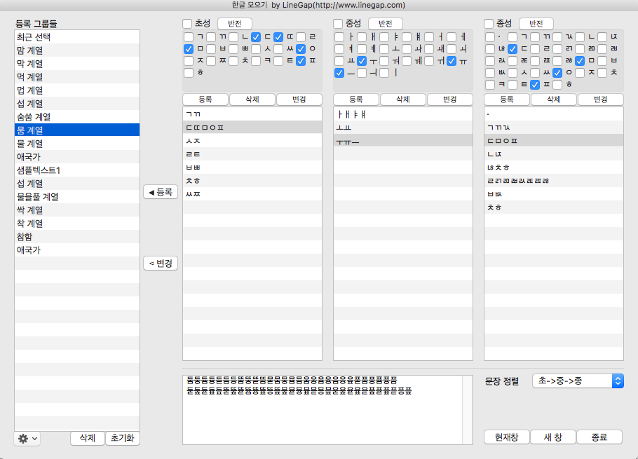
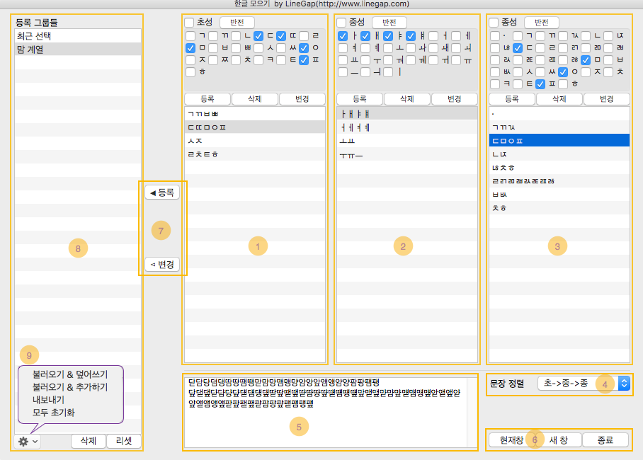

# CollectHangul_Glyphs
글립스(Glyphs)에서 초성, 중성, 종성 자소 선택으로 한글을 선택 및 입력하는 플러그인입니다.
(15일 데모 버전이며, 정식 등록은 <a href="http://www.linegap.com/portfolio-items/collect-hangul-in-glyphs/">라인갭 홈페이지</a>를 통해 안내 받으실 수 있습니다.)

This is a plugin for Glyphs that select or input Korean hangul characters(glyphs) by selecting consonants and vowels. It is a demo version that works for 15 days, and you need authorization to use full versions. if you want to use it, email me <a mailto:nanife@linegap.com">nanife (at) linegap.com</a>

* explanations

1. <b>초성 그룹</b>(Chosung : first consonants) : 선택된 초성 자소들을 그룹으로 등록, 등록된 그룹을 편집(register selected consonants to group list and edit group list)
2. <b>중성 그룹</b>(Jungsung : vowels) : 선택된 중성 자소들을 그룹으로 등록, 등록된 그룹을 편집(register selected vowels to group list and edit group list)
3. <b>종성 그룹</b>(Jongsung : final consonants) : 선택된 종성 자소들을 그룹으로 등록, 등록된 그룹을 편집(register selected consonants to group list and edit group list)
4. <b>문장 정렬</b>(sort order) : 선택된 초성, 중성, 종성들로 조합되는 글자들을 초성, 중성, 종성의 우선순위를 따라 정렬(sort characters composed by selected consonants and vowels according to the order of priority)
5. <b>조합된 문장</b>(글자들)(composed characters): 선택된 초성, 중성, 종성들과 정렬 옵션을 토대로 조합된 결과로, KS 한글과 유니코드 한글로 구분(the characters composed by selected consonants and vowels with the option of sort order, which are separated by KS X 1001 hangul and unicode hangul)
6. <b>문장 보기 / 선택</b>(input or select characters) : 5번의 글자들을 새로운 편집창 또는 현재 편집창으로 보거나,폰트창에서 선택(input the characters(in #5) to currently open or new tab / select characters in font view)
7. <b>조합 그룹 등록</b>(register all the selected to new group list) : 선택된 자소들, 정렬 순서, 조합 결과를 등록하거나, 이미 등록된 그룹을 변경(register each selected consonants, vowels,sort order, composed characters into new composed group list / update selected composed group with the selected condition)
8. <b>등록된 그룹</b>(registered group) : 사용자가 등록한 조합 그룹, 조합 그룹 편집(registered compsed characters' group / edit group list)
9. <b>그룹 정보 관리</b>(managing groups) : 현재 저장된 모든 그룹 정보를 내보내고, 불러오고, 초기화하는 기능(functions for export, import, reset)

 
<a href="https://youtu.be/eIovjJScv74">동영상 보러 가기</a>