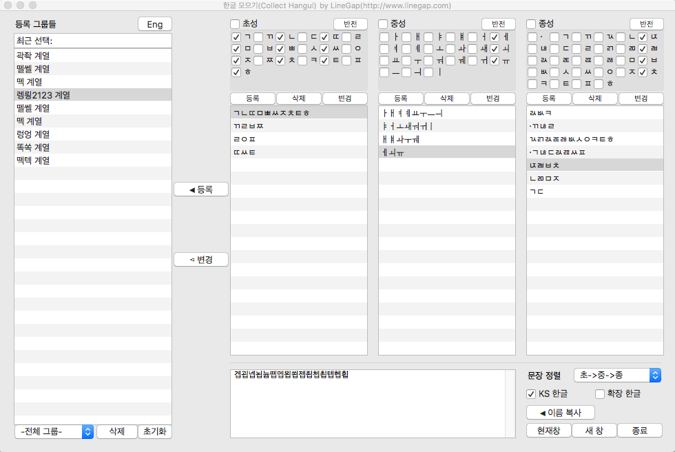
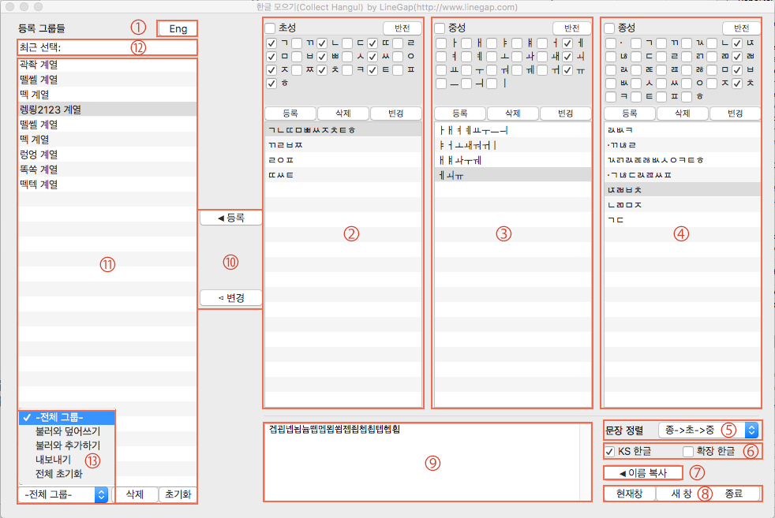
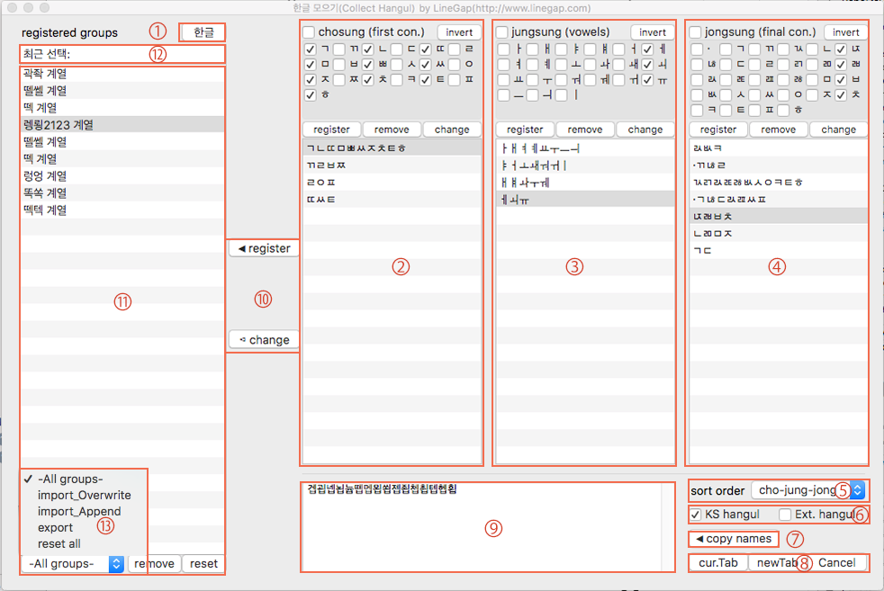
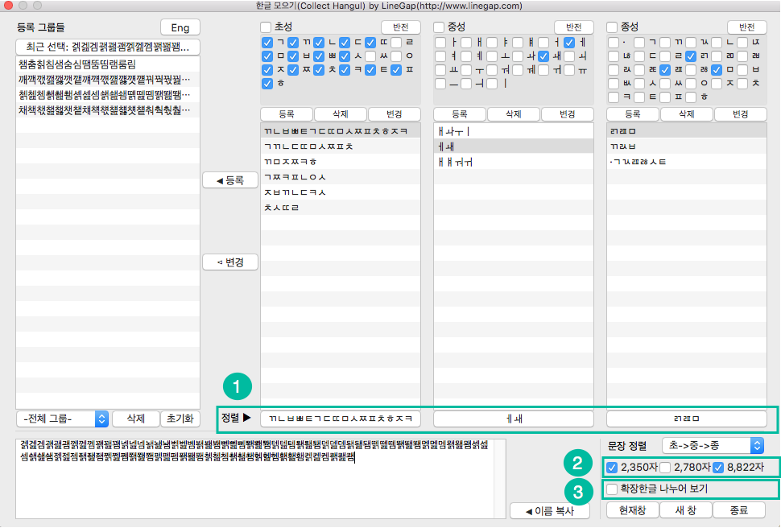
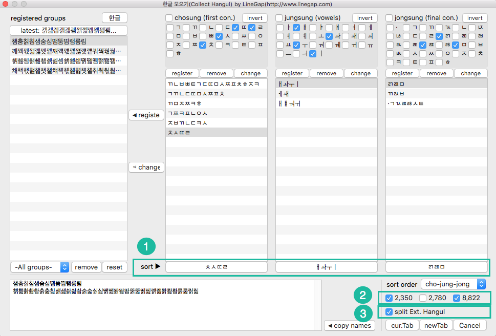

# CollectHangul_Glyphs
글립스(Glyphs)에서 초성, 중성, 종성 자소 선택으로 한글을 선택 및 입력하는 플러그인입니다.
(15일 데모 버전이며, 정식 등록은 <a href="http://www.linegap.com/portfolio-items/collect-hangul-in-glyphs/">라인갭 홈페이지</a>를 통해 안내 받으실 수 있습니다.)

This is a plugin for Glyphs that select or input Korean hangul characters(glyphs) by selecting consonants and vowels. It is a demo version that works for 15 days, and you need authorization to use full versions. if you want to use it, email me <a href="mailto:nanife@linegap.com">nanife (at) linegap.com</a>

* 설명(explanations)

1. <b>언어 설정</b>(language) : 한글 / 영문 중 원하는 언어를 선택할 수 있음(select Hangul or English)
2. <b>초성 그룹</b>(chosung : first consonants) : 선택된 초성 자소들을 그룹으로 등록, 등록된 그룹을 편집(register selected consonants to group list and edit group list)
3. <b>중성 그룹</b>(jungsung : vowels) : 선택된 중성 자소들을 그룹으로 등록, 등록된 그룹을 편집(register selected vowels to group list and edit group list)
4. <b>종성 그룹</b>(jongsung : final consonants) : 선택된 종성 자소들을 그룹으로 등록, 등록된 그룹을 편집(register selected consonants to group list and edit group list)
5. <b>문장 정렬</b>(sort order) : 선택된 초성, 중성, 종성들로 조합되는 글자들을 초성, 중성, 종성의 우선순위를 따라 정렬(sort characters composed by selected consonants and vowels according to the order of priority)
6. <b>한글 범위 선택</b>(range of hangul) : 선택되는 글자들의 범위를 KS 한글, 확장 한글에서 범위를 정해 선택 가능(select Hangul ranges in KSX 1001 hangul and extended Hangul)
7. <b>이름 복사</b>(copy names) : 선택된 글자들을 필터로 등록할 수 있도록 이름 복사(copy characters' name to register it to custom filters)
8. <b>문장 보기 / 선택</b>(input or select characters) : 9번의 글자들을 새로운 편집창 또는 현재 편집창으로 보거나,폰트창에서 선택(input the characters(in #5) to currently open or new tab / select characters in font view)
9. <b>조합된 문장</b>(글자들)(composed characters): 선택된 초성, 중성, 종성들과 정렬 옵션을 토대로 조합된 결과(2+3+4+5+6의 결과)로, KS 한글과 유니코드 한글로 구분(the characters composed by selected consonants and vowels with the option of sort order(2+3+4+5+6), which are separated by KS X 1001 hangul and unicode hangul)
10. <b>조합 그룹 등록</b>(register all the selected as a new group) : 선택된 자소들, 정렬 순서, 조합 결과를 등록하거나, 이미 등록된 그룹을 변경(register each selected consonants, vowels, sort order, hangul range, composed characters as a new group / update the selected composed group with the current selection)
11. <b>등록된 그룹</b>(registered group) : 사용자가 등록한 조합 그룹, 조합 그룹 편집(registered composed characters' group / edit group list)
12. <b>최근 선택된 결과</b>(latest selection) : 가장 최근에 선택되었던 그룹(latest selected group)
13. <b>그룹 정보 관리</b>(managing groups) : 현재 저장된 모든 그룹 정보를 내보내고, 불러오고, 초기화하는 기능(functions for export, import, reset)

  
* <b>업그레이드(upgrade to v1.5)</b>

  
a. <b>자소 순서 정렬</b>(sort consonants, vowels) : 자소의 순서를 정렬할 수 있고, 조합되는 문장이 자소의 순서를 따름(composed characters are sorted according to the order of sorted consonants and vowels)
 
b. <b>한글 그룹 추가</b>(added new hangul group) : Adobe-KR9 한글 그룹(2,780자:KS 2,350자 + 확장한글 430자) 추가(added new hangul character group for Adobe-KR9; 2,780 characters: KS 2,350 hangul + 430 extended hangul)
 
c. <b>한글 문장 나눔</b>(separate composed hangul characters) : 조합된 한글 문장의 KS 한글과 확장한글을 나누어 볼지 결정(select whether to separate KS hangul characters and extended hangul characters)
  

 
<a href="https://youtu.be/eIovjJScv74">동영상 보러 가기</a>